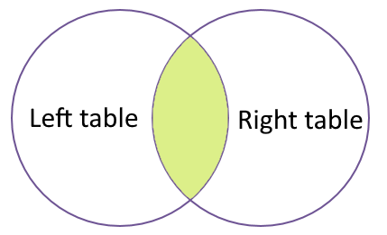

## Joins

Say that we have a table of books on loan to users with specific `PatronIds`:

| BookId | Author                           | Title                                | PatronId |
| ------ | -------------------------------- | ------------------------------------ | -------- |
| 1      | Richard Dawkins                  | The Blind Watchmaker                 | 3        |
| 2      | Douglas Adams                    | So long, and thanks for all the fish | 1        |
| 3      | Jane B. Reece, Lisa A. Urry      | Campbell Biology                     | 3        |
| 4      | George Orwell                    | 1984                                 | 2        |
| 5      | Ralph Leighton,  Richard Feynman | Surely You're Joking, Mr. Feynman    | 1        |
| 6      | Douglas Adams                    | Last Chance to See                   | 1        |
| 7      | Aldous Hyuxley                   | Brave New World                      | 1        |

<!-- &nbsp; -->

Notice that the table containing the books have no other information about the users than the `PatronId`

So, we need a table with information about the users:

| PatronId | Name          | Email               | Phone    |
| -------- | ------------- | ------------------- | -------- |
| 1        | Kent Baimilov | kentbai@gmail.com   | 97651234 |
| 2        | Barry Värson  | bv3445@hmotmail.com | 41658509 |
| 3        | Anna Nas      | anna.nas@yahoo.com  | 90675213 |

But that table contains no information about the users in regard to which books they have loaned. 
Wouldn't it be great to merge these tables somehow?.. But wait! There is!

<!-- &nbsp; -->

| BookId | Author                           | Title                                | PatronId | Name          | Email               | Phne     |
| ------ | -------------------------------- | ------------------------------------ | -------- | ------------- | ------------------- | -------- |
| 1      | Richard Dawkins                  | The Blind Watchmaker                 | 3        | Anna Nas      | anna.nas@yahoo.com  | 90675213 |
| 2      | Douglas Adams                    | So long, and thanks for all the fish | 1        | Kent Baimilov | kentbai@gmail.com   | 97651234 |
| 3      | Jane B. Reece, Lisa A. Urry      | Campbell Biology                     | 3        | Anna Nas      | anna.nas@yahoo.com  | 90675213 |
| 4      | George Orwell                    | 1984                                 | 2        | Barry Värson  | bv3445@hmotmail.com | 41658509 |
| 5      | Ralph Leighton,  Richard Feynman | Surely You're Joking, Mr. Feynman    | 1        | Kent Baimilov | kentbai@gmail.com   | 97651234 |
| 6      | Douglas Adams                    | Last Chance to See                   | 1        | Kent Baimilov | kentbai@gmail.com   | 97651234 |
| 7      | Aldous Hyuxley                   | Brave New World                      | 1        | Kent Baimilov | kentbai@gmail.com   | 97651234 |

This is the result of two tables being joined, connected to each other through the common `PatronId` column. 

To combine data from two tables we use the SQL `JOIN` command, which comes after
the `FROM` command.

We also need to tell the computer which columns provide the link between the two
tables using the word `ON`.  

In the example above this join query would look something like this:

> SELECT * FROM Books JOIN Users ON Books.PatronId = Users.PatronID;

For our tables it would look like this:

~~~
SELECT * FROM articles JOIN journals ON articles.issns = journals.issns;
~~~
{: .source}

`ON` is like `WHERE`, it filters things out according to a test condition.  We use
the `table.colname` format to tell the manager what column in which table we are
referring to.

Alternatively, we can use the word `USING`, as a short-hand.  In this case we are
telling the manager that we want to combine `articles` with `journals` and that
the common column is `issns`.

~~~
SELECT * FROM articles JOIN journals USING (issns);
~~~
{: .source}

We often won't want all of the fields from both tables, so anywhere we would
have used a field name in a non-join query, we can use `table.colname`.

For example, what if we wanted information on published articles in different
journals, but instead of their ISSN we wanted the actual journal title.

~~~
.width 30 10 10 20
SELECT title, first_author, articles.issns, journal_title FROM articles JOIN journals ON articles.issns = journals.issns;
~~~
{: .source}

Joins can be combined with sorting, filtering, and aggregation.  So, if we
wanted average number of authors for articles on different journals, we
could do something like

~~~
.width 30 10 10 15 3
SELECT title, first_author, articles.issns, journal_title, ROUND(AVG(author_count), 2) 
FROM articles 
JOIN journals 
ON articles.issns = journals.issns
GROUP BY articles.issns;
~~~
{: .source}

> ## Challenge:
>
> Write a query that returns the journal title, total number of articles published
> and average number of citations for every journal.
{: .challenge}

It is worth mentioning that you can join multiple tables. For example:

~~~
.width 30 15 15 2
SELECT title, first_author, journal_title, language
FROM articles
JOIN journals
ON articles.issns = journals.issns
JOIN languages
ON languages.id = articles.languageid;
~~~
{: .source}
> ## Challenge:
>
> Write a query that returns the journal title, publisher name, and number of
> articles published, ordered by number of articles in descending order.
{: .challenge}

## Aliases

As queries get more complex names can get long and unwieldy. To help make things
clearer we can use aliases to assign new names to things in the query.

We can alias both table names:

~~~
SELECT ar.title, ar.first_author, jo.journal_title
FROM articles AS ar
JOIN journals  AS jo
ON ar.issns = jo.issns;
~~~
{: .source}
And column names:

~~~
SELECT ar.title AS title, ar.first_author AS author, jo.journal_title AS journal
FROM articles AS ar
JOIN journals  AS jo
ON ar.issns = jo.issns;
~~~
{: .source}

The `AS` isn't technically required, so you could do

~~~
SELECT a.title t
FROM articles a;
~~~
{: .source}

but using `AS` is much clearer so it is __good__ style to include it.

## Extra Challenges (optional)

SQL queries help us *ask* specific *questions* which we want to answer about
our data. The real skill with SQL is to know how to translate our scientific
questions into a sensible SQL query (and subsequently visualize and interpret
our results).

Have a look at the following questions; these questions are written in plain
English. Can you translate them to *SQL queries* and give a suitable answer?

> ## Challenge 1
> How many plots from each type are there?
>
> > ## Solution 1
> > ~~~
> > SELECT first_author, COUNT( * ) AS n_articles
> > FROM articles
> > GROUP BY first_author
> > ORDER BY n_articles DESC
> > ~~~
> > {: .sql}
> {: .solution}
{: .challenge}

> ## Challenge 2
> How many papers have a single author? How many have 2 authors? How many 3? etc?
>
> > ## Solution 2
> > ~~~
> > SELECT author_count, count( * )
> > FROM articles
> > GROUP BY author_count
> > ~~~
> > {: .sql}
> {: .solution}
{: .challenge}

> ## Challenge 3
> How many articles are published for each language? (Ignore articles where
> language is unknown).
>
> > ## Solution 3
> > ~~~
> > SELECT language, count( * )
> > FROM articles
> > JOIN languages
> > ON articles.languageid=languages.id
> > WHERE language IS NOT null
> > GROUP BY language
> > ~~~
> > {: .sql}
> {: .solution}
{: .challenge}

> ## Challenge 4
> How many articles are published for each licence type, and what is the average
> number of citations for that licence type
>
> > ## Solution 4
> > ~~~
> > SELECT licence, avg( citation_count ), count( * )
> > FROM articles
> > JOIN licences
> > ON articles.licenceid=licences.id
> > WHERE licence IS NOT null
> > GROUP BY licence
> > ~~~
> > {: .sql}
> {: .solution}
{: .challenge}

> ## Challenge 5
> Create a view with article, journal and publisher information
>
> > ## Solution 5
> > ~~~
> > CREATE VIEW all_data AS
> > SELECT title, first_author, author_count, citation_count, month, year, journal_title, publisher
> > FROM articles
> > JOIN journals
> > ON articles.issns=journals.issns
> > JOIN publishers
> > ON publishers.id=journals.publisherid
> > ~~~
> > {: .sql}
> {: .solution}
{: .challenge}
